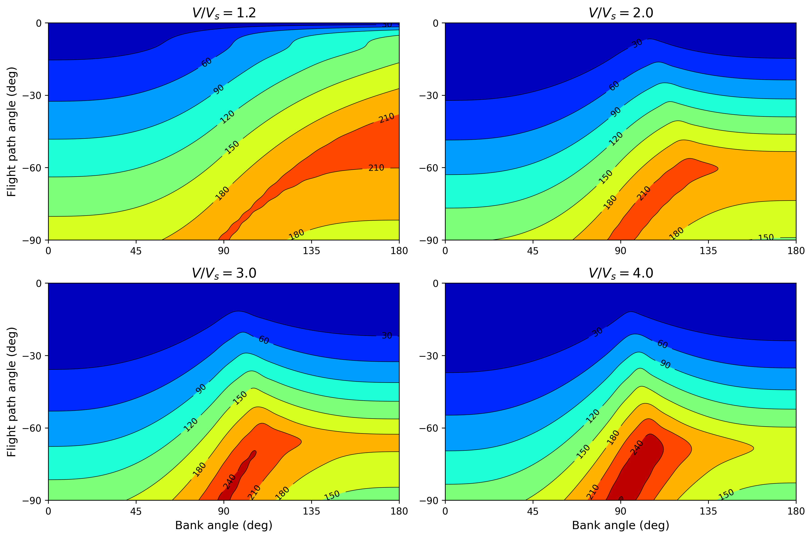
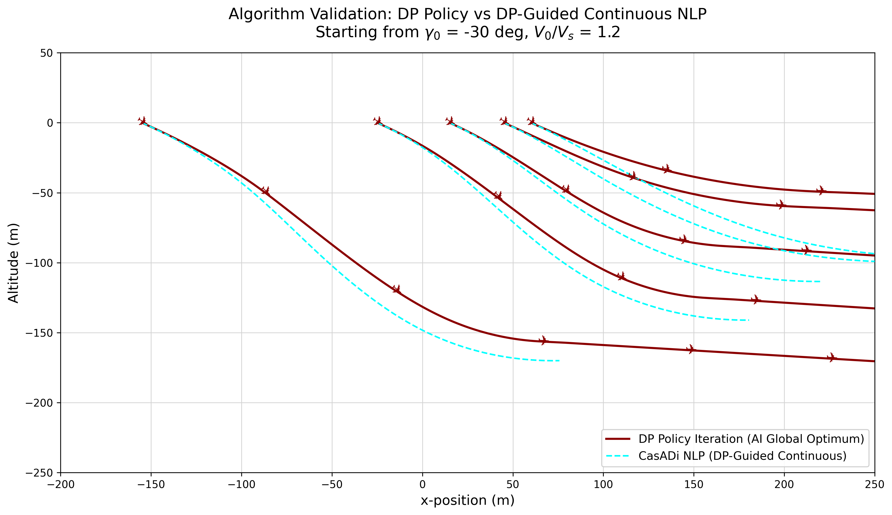
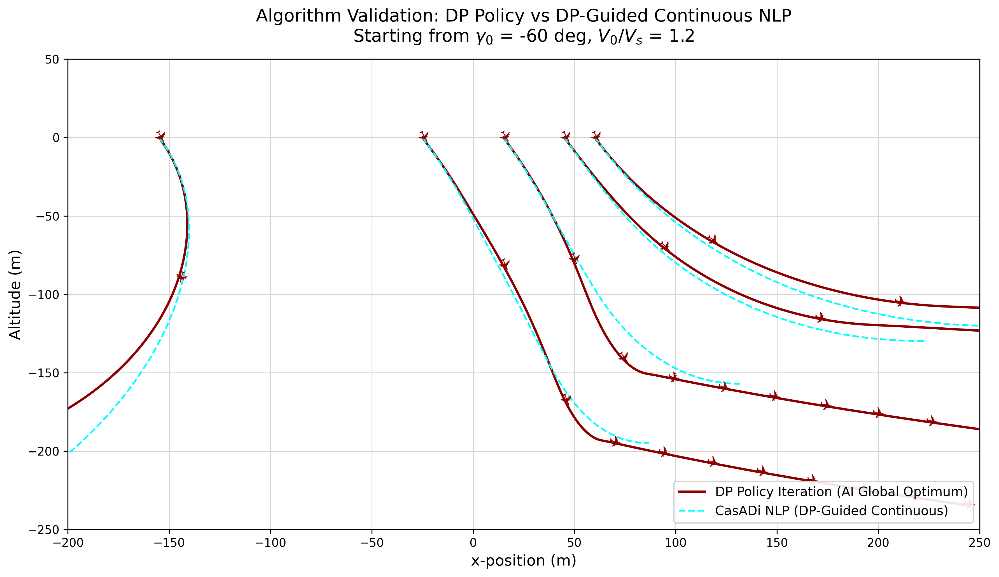
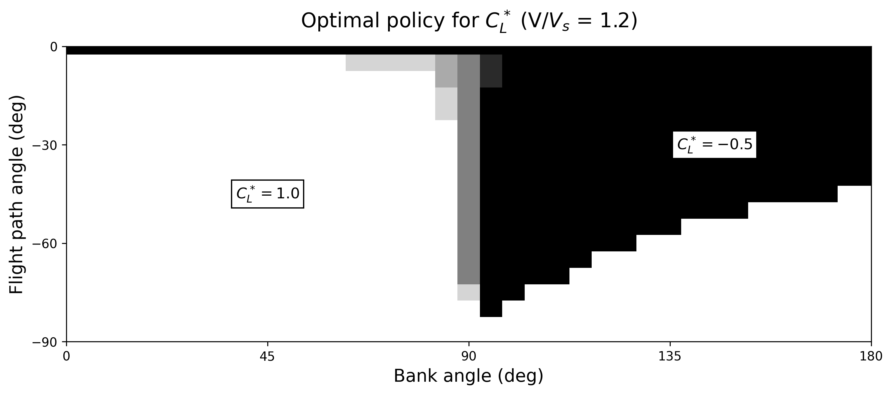
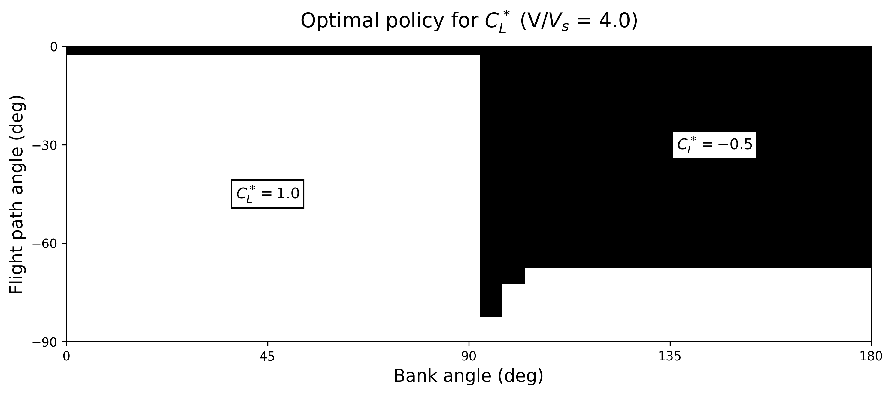
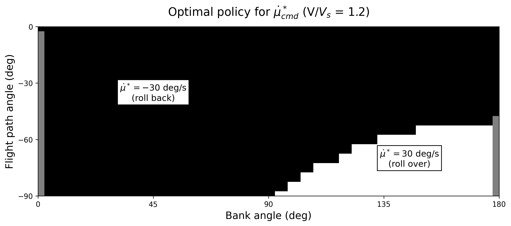
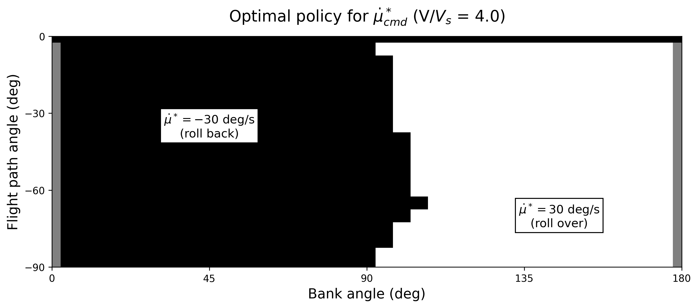

# 3-DOF Reduced Banked Pullout Model

Research code for aircraft stall and spin upset recovery using VRAM-accelerated Dynamic Programming.
The core approach solves the minimal altitude loss recovery problem as an infinite-horizon optimal control
problem via massively parallel Policy Iteration on continuous-state MDPs. Dynamics are integrated
on-the-fly using 4th-order Runge-Kutta entirely within GPU registers, avoiding the memory-bound
limitations of traditional transition table methods. Reference aircraft: **Grumman AA-1 Yankee**
(Riley 1985, NASA TM-86309).

*Based on: Bunge, Pavone & Kroo, "Minimal Altitude Loss Pullout Maneuvers," AIAA GNC 2018.*

---

## Project Structure

```
stall-spin/
├── main.py                          # Entry point — pipeline train/load → profile → plot
├── requirements.txt
├── README.md
├── papers/                          # Reference papers (Bunge 2018, etc.)
├── results/                         # Output: policy .npz, plots, profiling reports
│
├── aircraft/                        # Physical aircraft models
│   ├── grumman.py                   # AA-1 Yankee: parameters, aerodynamic coefficients,
│   │                                #   and helper methods (CL, CD, Cm, RK4 integrator)
│   └── reduced_grumman.py          # 3DOF reduced dynamics: implements the coupled
│                                    #   V̇, γ̇, μ̇ equations via vectorized RK4
│
├── envs/                            # Gymnasium environments
│   ├── __init__.py                  # Gym registration (ReducedBankedGliderPullout-v0)
│   ├── base.py                      # AirplaneEnv: base gym.Env with render/seed scaffold
│   └── reduced_banked_pullout.py   # 3DOF banked glider env: observation/action spaces,
│                                    #   step(), reset(), terminal condition (γ ≥ 0)
│
├── solver/                          # Optimization algorithms
│   ├── policy_iteration.py          # GPU Policy Iteration: CUDA kernels for RK4 dynamics,
│   │                                #   barycentric interpolation, Bellman updates,
│   │                                #   policy evaluation and improvement loops
│   └── casadi_optimizer.py         # CasADi/IPOPT NLP: multiple-shooting trajectory
│                                    #   optimizer warm-started from the DP policy
│
└── analysis/                        # Training configs, visualization and inference
    ├── experiments.py               # Grid level configs (L1–L4), Numba state/action
    │                                #   space generators, GPU profiling with CUDA events
    ├── plotting.py                  # Policy heatmaps, value function contours,
    │                                #   DP vs CasADi trajectory validation plots
    └── interpolation.py            # Barycentric interpolation on N-D regular grids
                                     #   and get_optimal_action() for inference
```

---

## Installation

**Requirements:** Python 3.10+, NVIDIA GPU with CUDA-capable driver.

### 1. Create virtual environment

```bash
python -m venv .venv
source .venv/bin/activate
```

### 2. Install dependencies

```bash
pip install -r requirements.txt
```

### 3. Install CuPy (GPU backend)

CuPy must be installed separately because the correct wheel depends on your CUDA driver version.
Check your CUDA version with:

```bash
nvidia-smi
```

Then install the matching wheel:

| CUDA version (nvidia-smi) | Install command |
|---|---|
| 11.x | `pip install cupy-cuda11x` |
| 12.x | `pip install cupy-cuda12x` |
| 13.x | `pip install cupy-cuda12x` *(use 12x, backward-compatible)* |

> CuPy does not require the full CUDA toolkit (`nvcc`) — only the NVIDIA driver.
> If you get a `libnvrtc.so not found` error, install the CUDA runtime libraries:
> ```bash
> pip install nvidia-cuda-nvrtc-cu12 nvidia-cuda-runtime-cu12
> ```

### 4. Run

```bash
python main_banked.py --level 1
```

Use `--retrain` to force retraining instead of loading a cached policy:

```bash
python main_banked.py --level 1 --retrain
```

---

## Model Description

This branch implements the reduced-order 3-DOF point-mass model from the paper, derived from
the full 6-DOF equations under the following simplifying assumptions:

- **β ≈ 0**: sideslip angle remains near zero throughout the maneuver.
- **CL and μ̇ are directly commanded** by inner-loop controllers (high-bandwidth, dynamics neglected).
- **CD = CD(CL)**: drag is a function of lift coefficient only (no sideslip dependency).
- **CY ≈ 0**: lateral aerodynamic side force is negligible.
- **Idle power** (δt not a control input; this investigation is limited to idle power maneuvers).

Under these assumptions the full equations of motion (Appendix A.2 of the paper) reduce to a
3-state system with state **x = (V, γ, μ)** and control **a = (CL_cmd, μ̇_cmd)**.

---

## Equations of Motion

```
V̇  = -g sin γ  -  (1/2) ρ (S/m) V² CD(CL_cmd)             (3a)
γ̇  =  (1/2) ρ (S/m) V CL_cmd cos μ  -  (g/V) cos γ        (3b)
μ̇  =  μ̇_cmd                                               (3c)
```

---

## Aerodynamic Model — Grumman American AA-1 Yankee

Stability and control derivative model (Eq. 14, Table 2 of the paper). All angular derivatives per radian.

**Longitudinal:**
```
CL = 0.4100  +  4.6983 α  +  0.3610 δe  +  2.4200 q̂
CD = 0.0525  +  0.2068 α  +  1.8712 α²
Cm = 0.0760  -  0.8938 α  -  1.0313 δe  -  7.1500 q̂
```

**Lateral-directional:**
```
CY = -0.6303 β  +  0.0160 p̂  +  1.1000 r̂  -  0.0057 δa  +  0.1690 δr
Cl = -0.1089 β  -  0.5200 p̂  +  0.1900 r̂  -  0.1031 δa  +  0.0143 δr
Cn =  0.1003 β  -  0.0600 p̂  -  0.2000 r̂  +  0.0017 δa  -  0.0802 δr
```

**Aircraft parameters:**

| Parameter | Value | Units |
|---|---|---|
| m (mass) | 697.18 | kg |
| S (wing area) | 9.1147 | m² |
| b (wingspan) | 7.41 | m |
| ρ (sea-level density) | 1.225 | kg/m³ |
| CL_max (positive stall) | 1.2 | — |
| CL_min (negative stall) | −0.7 | — |
| Vs (stall speed) | ≈ 32 | m/s |

Vs is computed from level-flight equilibrium at CL_max:
```
Vs = sqrt(2 m g / (ρ S CL_max))
   = sqrt(2 × 697.18 × 9.81 / (1.225 × 9.1147 × 1.2))  ≈  31.9 m/s
```

> **Bug in PolicyIteration.py:** `v_stall` is computed using
> `cl_ref = CL0 + CLA * deg2rad(15) ≈ 1.64` (above stall CL), giving Vs ≈ 27.3 m/s
> instead of ≈ 32 m/s. Fix: use `CL_max = 1.2` as the reference.

---

## Control Bounds

To prevent secondary stalls, CL_cmd is constrained within a safety margin of 0.2 from the
stall limits:

```
-0.5  ≤  CL_cmd  ≤  1.0                                   (4)
```

The bank rate command is bounded by the steady-state roll rate achievable with maximum aileron
deflection at the stall speed reference:

```
|μ̇_cmd|  ≤  μ̇_max  ≈  p_max                              (5a)

p_max  ≈  p̂_max (2 V_ref / b)  =  |Cl_δa / Cl_p| δa_max (2 V_ref / b)   (5b)
```

For the AA-1 Yankee: Cl_p ≈ −0.5, Cl_δa ≈ −0.0595 1/deg, δa_max = 25 deg, b = 7.41 m,
Vs ≈ 32 m/s → **p_max ≈ 30 deg/s**.

---

## State-Space Discretization (Table 1 of the paper)

| Variable | Lower Bound | Increment | Upper Bound | Units |
|---|---|---|---|---|
| V | 0.9 | 0.1 | 4.0 | 1/Vs |
| γ | −180 | 5 | 0 | deg |
| μ | −20 | 5 | 200 | deg |
| CL_cmd | −0.5 | 0.25 | 1.0 | — |
| μ̇_cmd | −30 | 5 | 30 | deg/s |

---

## Results

### Value Function — Minimum Altitude Loss (m)

Minimum pullout altitude loss as a function of bank angle and flight path angle,
for four normalized airspeeds. Warmer colors indicate greater altitude loss.



---

### Algorithm Validation — DP Policy vs CasADi NLP

Optimal pullout trajectories comparing the DP Policy Iteration solution (global optimum, dark red)
against a CasADi/IPOPT continuous NLP warm-started from the DP policy (cyan dashed).
Each curve corresponds to a different initial bank angle μ₀ ∈ {30, 60, 90, 120, 150} deg (left to right).

| γ₀ = −30 deg, V/Vs = 1.2 | γ₀ = −60 deg, V/Vs = 1.2 |
|:---:|:---:|
|  |  |

---

### Optimal Policy for C*_L

White = C*_L = 1.0 (max lift, pull up). Black = C*_L = −0.5 (push forward, inverted pullout).
The switching surface shifts with airspeed.

| V/Vs = 1.2 | V/Vs = 4.0 |
|:---:|:---:|
|  |  |

---

### Optimal Policy for μ̇*_cmd

Black = −30 deg/s (roll back to wings-level). White = +30 deg/s (roll over, inverted).

| V/Vs = 1.2 | V/Vs = 4.0 |
|:---:|:---:|
|  |  |

---

## Nomenclature

| Symbol | Meaning |
|---|---|
| ρ | air density |
| b | wing span |
| c | chord length |
| S | wing surface area |
| px, py, pz | northward, eastward and down position |
| h | altitude, from the ground |
| u, v, w | body-x, y and z velocity |
| V | airspeed |
| Vs | stall speed |
| α | angle of attack |
| β | sideslip angle |
| φ, θ, ψ | roll, pitch and yaw angles |
| γ | flight path angle |
| ξ | heading angle |
| μ | bank angle |
| ε₀, ε₁, ε₂, ε₃ | Euler (quaternion) parameters |
| p̂ | dimensionless roll rate, p̂ = pb/2V |
| p, q, r | roll, pitch and yaw rate |
| δe | elevator deflection, positive trailing edge down |
| δr | rudder deflection, positive trailing edge to the left |
| δa | aileron deflection, positive trailing edge down of right aileron |
| δt | throttle position |
| CL_cmd | commanded lift coefficient (outer-loop control input) |
| μ̇_cmd | commanded bank rate (outer-loop control input) |
| L, D, Y | aerodynamic lift, drag and side force |
| Mx, My, Mz | aerodynamic rolling, pitching and yawing moment about the c.g. |
| CL, CD, CY | aerodynamic lift, drag and side force coefficient |
| Cl, Cm, Cn | aerodynamic rolling, pitching and yawing moment coefficient about the c.g. |
| f | system dynamic equation of motion |
| J | value function |
| g | stage cost |
| a | vector of actions |
