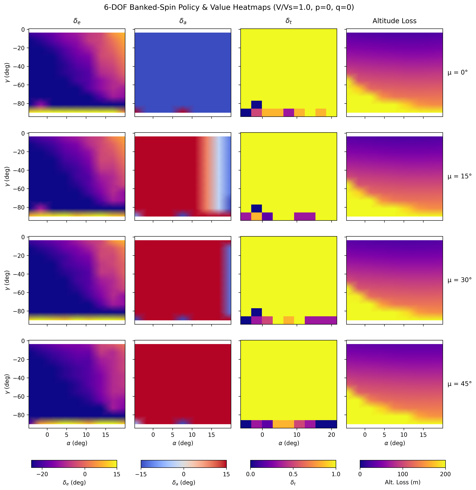
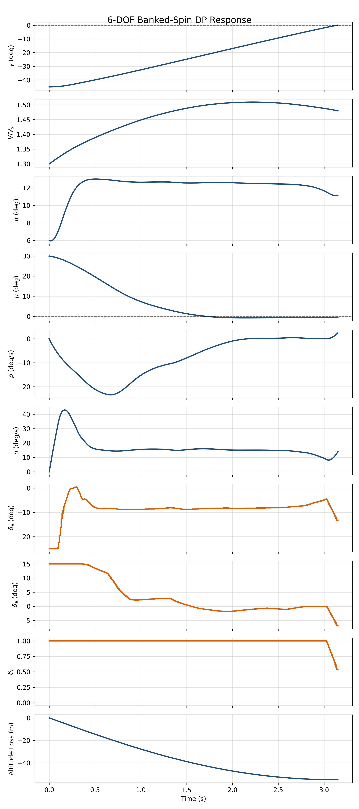

# 6DOF Banked-Spin Recovery — Riley (1985) Aerodynamic Model

Research code for optimal stall and bank recovery using GPU-accelerated Policy Iteration.
The problem is formulated as an infinite-horizon optimal control problem solved via
massively parallel Policy Iteration on continuous-state MDPs. Dynamics are integrated
on-the-fly using 4th-order Runge-Kutta entirely within GPU registers, avoiding the
memory-bound limitations of traditional transition table methods.

This branch extends the symmetric 4DOF stall-recovery model to a **6-degree-of-freedom
banked-spin recovery** under simplification **A.i** (zero sideslip and zero yaw rate).
The aircraft is allowed to roll and bank: the policy must coordinate elevator, aileron
and throttle to recover from a banked descent with stalled or near-stalled angle of
attack. The full nonlinear aerodynamic model of the Grumman AA-1 Yankee is used,
derived from wind-tunnel measurements reported in Riley (1985), NASA TM-86309.
Longitudinal coefficients ($C_L$, $C_D$, $C_m$) and the rolling-moment derivatives
($C_{l,o}$, $C_{l,\hat{p}}$, $C_{l,\delta_a}$) are tabulated as a function of angle of
attack $\alpha$ and thrust coefficient $C_T$.

> **Aerodynamic model reference:**
> Riley, D. R. (1985).
> *Simulator Study of the Stall Departure Characteristics of a Light General Aviation
> Airplane With and Without a Wing-Leading-Edge Modification.*
> NASA Technical Memorandum 86309, Langley Research Center, Hampton, Virginia.

> **Optimal control references:**
> Grillo, C., Torre, F., & Bunge, R. A. (2023).
> *Optimal Stall Recovery via Deep Reinforcement Learning for a General Aviation Aircraft.*
> AIAA SciTech Forum, National Harbor, MD.
>
> Bunge, R. A., Pavone, M., & Kroo, I. M. (2018).
> *Minimal Altitude Loss Pullout Maneuvers.* AIAA GNC Conference.

---

## Project Structure

```
stall-spin-recovery-dp/
├── main_banked_spin.py              # Entry point — train/load → simulate → plot
├── validate_banked_spin.py          # Regression suite (Riley sanity, RK4 invariance,
│                                    #   spin-entry trajectory, GPU smoke)
├── PolicyIterationBankedSpin.py     # GPU Policy Iteration: 6D barycentric (64 corners),
│                                    #   embedded Riley III(a-c, f) tables, Bellman kernels
│
├── aircraft/
│   ├── grumman.py                   # AA-1 Yankee parameters + Riley III(a-c, f) tables
│   ├── extended_grumman.py          # Full 7+1-state scaffolding (β, r, μ, p, …)
│   ├── airplane_env.py              # Gymnasium base env
│   ├── banked_spin_grumman.py       # 6DOF CPU dynamics: RK4 over (γ, V/Vs, α, μ, p, q)
│   └── banked_spin.py               # Gymnasium env: 6D obs, 3D action, Markov reward
│
├── utils/
│   └── utils.py                     # N-D barycentric interpolation, get_optimal_action
│
├── papers/                          # Reference papers (Riley 1985, etc.)
└── results/                         # Output: policy .npz, plots
```

---

## Running

### Requirements

- Python 3.10+
- NVIDIA GPU with CUDA-capable driver (for training)
- Dependencies in `requirements.txt`
- CuPy installed separately (matching your CUDA version):

```bash
nvidia-smi                            # check CUDA driver version
pip install cupy-cuda12x              # or cupy-cuda11x for CUDA 11
```

### Quick sanity check (~30 s)

Before running the long training, verify the pipeline:

```bash
python3 validate_banked_spin.py
```

This runs four regression tests: Riley III(f) table lookups, symmetric-subspace
invariance under the RK4 integrator, open-loop spin-entry trajectory, and a small
GPU PI smoke run.

### Training and visualization

```bash
python3 main_banked_spin.py
```

The script trains a new policy, or loads `results/BankedSpin_policy.npz` if it
exists. Default grid size and reward weights are set in `setup_banked_spin_experiment()`
in `main_banked_spin.py` — edit there to scale the experiment.

To force retraining, delete the cache:

```bash
rm -f results/BankedSpin_policy.npz
```

### Output files

| File | Description |
|---|---|
| `results/BankedSpin_policy.npz` | Trained value function and policy |
| `results/banked_spin_trajectory.png` | Recovery trajectory (10-panel time response) |
| `results/banked_spin_heatmaps.png` | Optimal policy heatmaps over four bank-angle slices |

---

## Aerodynamic Model

### Background

Riley (1985) developed a six-degree-of-freedom nonlinear simulation of the Grumman AA-1
Yankee, a two-place, single-engine, low-wing general aviation aircraft, for the stall
and initial departure region of flight. The mathematical model was established from
**full-scale powered wind-tunnel tests** conducted at the NASA Langley 30- by 60-Foot
Tunnel. The tests covered the complete angle-of-attack range from $-10°$ to $+40°$ and
included both power-off ($C_T = 0$) and power-on ($C_T = 0.5$) conditions.

The key feature of this model is that **thrust effects are not added as a separate term
in the equations of motion**. Instead, the propeller slipstream modifies the aerodynamic
environment over the wing, so its effect is absorbed directly into the aerodynamic
coefficient tables indexed by the thrust coefficient $C_T$. This coupling is particularly
significant at high angles of attack and near-stall speeds.

### Aerodynamic Coefficient Tables

Each coefficient is tabulated at 14 angle-of-attack breakpoints:

$$\alpha \in \{-10°,\ -5°,\ 0°,\ 5°,\ 10°,\ 12°,\ 14°,\ 16°,\ 18°,\ 20°,\ 25°,\ 30°,\ 35°,\ 40°\}$$

and at two thrust coefficient values, $C_T = 0$ (power-off) and $C_T = 0.5$ (power-on).
During simulation a **bilinear interpolation** is performed: linear in $\alpha$ within
each $C_T$ table, then linear between the two $C_T$ tables:

$$f(\alpha, C_T) = f(\alpha,\, 0) + \frac{C_T}{0.5}\,\bigl[f(\alpha,\, 0.5) - f(\alpha,\, 0)\bigr]$$

#### Longitudinal — Riley Table III(a-c)

| Coefficient | Symbol | Description |
|---|---|---|
| Lift (baseline) | $C_{L,o}(\alpha, C_T)$ | Nonlinear lift; flat-top plateau 14°–18° at $C_T=0$ ($C_{L,\max}=1.26$) |
| Lift (pitch rate) | $C_{L,q}(\alpha, C_T)$ | Pitch-rate damping contribution to lift |
| Lift (elevator) | $C_{L,\delta_e}(\alpha, C_T)$ | Elevator effectiveness on lift |
| Drag (baseline) | $C_{D,o}(\alpha, C_T)$ | Strong post-stall rise; negative values at low $\alpha$ for $C_T=0.5$ (propulsive) |
| Pitching moment (baseline) | $C_{m,o}(\alpha, C_T)$ | Nose-down moment increasing with $\alpha$ |
| Pitching moment (pitch rate) | $C_{m,q}(\alpha, C_T)$ | Pitch damping; large negative values near stall |
| Pitching moment (elevator) | $C_{m,\delta_e}(\alpha, C_T)$ | Elevator effectiveness on pitching moment |

The longitudinal coefficients used in the EOM are assembled as:

$$C_L = C_{L,o} + C_{L,\delta_e}\,\delta_e + C_{L,q}\,\hat{q}$$

$$C_D = C_{D,o}$$

$$C_m = C_{m,o} + C_{m,\delta_e}\,\delta_e + C_{m,q}\,\hat{q}$$

with non-dimensional pitch rate $\hat{q} = q\bar{c}/(2V)$.

#### Lateral — Riley Table III(f), rolling moment

Under simplification A.i ($\beta = 0$, $r = 0$, $\delta_r = 0$) only three of the six
lateral derivatives feed back into the dynamics; the others are skipped:

| Coefficient | Symbol | Description |
|---|---|---|
| Rolling moment (baseline) | $C_{l,o}(\alpha, C_T)$ | Asymmetric base coefficient (small, post-stall driven) |
| Rolling moment (roll rate) | $C_{l,\hat{p}}(\alpha, C_T)$ | Roll damping; $\approx -0.52$ at trim, vanishes near $\alpha = 20°$ |
| Rolling moment (aileron) | $C_{l,\delta_a}(\alpha)$ | Aileron effectiveness ($C_T$-independent) |

Excluded under A.i (would only matter if $r$ became a 7th state in a future branch):
$C_{l,\beta}$, $C_{l,\hat{r}}$, $C_{l,\delta_r}$, the side-force table III(d), and the
yawing-moment table III(e). These are loaded into the kernel as `0` implicitly because
the corresponding state/control components are pinned to zero.

The rolling-moment coefficient is then:

$$C_l = C_{l,o} + C_{l,\hat{p}}\,\hat{p} + C_{l,\delta_a}\,\delta_a$$

with non-dimensional roll rate $\hat{p} = pb/(2V)$.

### Thrust Coefficient

The thrust coefficient $C_T$ is computed from the throttle command $\delta_t$ and the
current airspeed $V$:

$$C_T = \min\!\Bigl(0.5,\ \max\!\Bigl(0,\ \frac{K_t\,\delta_t}{\tfrac{1}{2}\rho V^2 S}\Bigr)\Bigr)$$

where $K_t$ is calibrated so that full throttle ($\delta_t = 1$) produces level flight
at twice the stall speed ($V = 2V_s$).

### Physical Constants (Riley 1985, Table I)

| Parameter | Symbol | Value |
|---|---|---|
| Mass | $m$ | 715.21 kg |
| Wing area | $S$ | 9.1147 m² |
| Mean aerodynamic chord | $\bar{c}$ | 1.22 m |
| Wing span | $b$ | 8.066 m |
| Pitch inertia | $I_{yy}$ | 1000.60 kg·m² |
| Roll inertia | $I_{xx}$ | 808.06 kg·m² |
| Yaw inertia | $I_{zz}$ | 1719.18 kg·m² |
| Air density (sea level) | $\rho$ | 1.225 kg/m³ |

---

## Simplification A.i — pinned sideslip and yaw rate

The Riley equations of motion are fully 6-DOF in body axes ($\dot{u}, \dot{v}, \dot{w},
\dot{p}, \dot{q}, \dot{r}$). The full state is 12-dimensional once positions and
attitude are included, which is intractable for tabular Policy Iteration. We adopt
**simplification A.i**, the same assumption used by the legacy `BankedSpin` reference
implementation:

$$\beta \equiv 0, \qquad r \equiv 0, \qquad \delta_r \equiv 0$$

This is equivalent to a *banked-pullout* model: the aircraft can bank, roll, pitch and
descend, but it does not yaw. Side-force ($C_y$) and yawing-moment ($C_n$) tables are
not integrated. With $\beta=0$ the side force does not couple into the dynamics; with
$r=0$ the yawing moment is silently ignored. This is a conscious approximation —
**it does not capture a developed spin** (where $r$ dominates), only banked descents
with non-zero roll dynamics. A future branch would lift this restriction by adding
$r$ as a 7th state.

---

## Equations of Motion

In stability-axis representation, with the simplifications above, the 6-state system is:

$$\dot{V} = -g\sin\gamma - \frac{D}{m}$$

$$\dot{\gamma} = \frac{L\cos\mu}{mV} - \frac{g}{V}\cos\gamma$$

$$\dot{\alpha} = q - \frac{L}{mV} + \frac{g}{V}\cos\gamma\cos\mu$$

$$\dot{\mu} = p\cos\alpha + \sin\mu\,\tan\gamma\,\frac{L}{mV}$$

$$\dot{p} = \frac{L_b}{I_{xx}}, \qquad \dot{q} = \frac{M_y}{I_{yy}}$$

where the aerodynamic forces and moments are:

$$L = \tfrac{1}{2}\rho V^2 S\, C_L(\alpha, C_T, \delta_e, \hat{q})$$

$$D = \tfrac{1}{2}\rho V^2 S\, C_D(\alpha, C_T)$$

$$M_y = \tfrac{1}{2}\rho V^2 S\bar{c}\, C_m(\alpha, C_T, \delta_e, \hat{q})$$

$$L_b = \tfrac{1}{2}\rho V^2 S\,b\, C_l(\alpha, C_T, \hat{p}, \delta_a)$$

Thrust is fully embedded in $C_L$, $C_D$, $C_m$ through $C_T$; no explicit thrust term
appears in the EOM. With $\mu = 0$, $p = 0$, $\delta_a = 0$ the system collapses
**exactly** to the symmetric 4DOF model — the symmetric subspace is invariant under
the integrator (verified bit-exactly in `validate_banked_spin.py`).

The state and control variables are:

| Variable | Symbol | Description |
|---|---|---|
| Flight path angle | $\gamma$ | angle between velocity vector and horizon |
| Normalized airspeed | $V/V_s$ | airspeed normalized by stall speed |
| Angle of attack | $\alpha$ | angle between velocity vector and body x-axis |
| Bank angle | $\mu$ | rotation about velocity vector |
| Roll rate | $p$ | body-axis roll rate |
| Pitch rate | $q$ | body-axis pitch rate |
| Elevator deflection | $\delta_e$ | control input, $[-25°,\, +15°]$ |
| Aileron deflection | $\delta_a$ | control input, $[-15°,\, +15°]$ |
| Throttle | $\delta_t$ | control input, $[0,\, 1]$ |

Integration uses a fixed-step **4th-order Runge-Kutta** scheme at $dt = 0.01\,\text{s}$.

---

## Discretization

### State Space — example default grid (~36M nodes)

| State | Min | Max | Bins | Resolution |
|---|---|---|---|---|
| $\gamma$ | $-90°$ | $5°$ | 20 | $\approx 5°$ |
| $V/V_s$ | $0.9$ | $2.0$ | 20 | $\approx 0.058$ |
| $\alpha$ | $-14°$ | $20°$ | 20 | $\approx 1.7°$ |
| $\mu$ | $-60°$ | $60°$ | 20 | $\approx 6°$ |
| $p$ | $-2.0$ rad/s | $2.0$ rad/s | 15 | $\approx 0.27$ rad/s |
| $q$ | $-50°/\text{s}$ | $50°/\text{s}$ | 15 | $\approx 7°/\text{s}$ |

Total: $20 \times 20 \times 20 \times 20 \times 15 \times 15 = 36{,}000{,}000$ states.
The grid is parametrisable in `setup_banked_spin_experiment()`; scale up or down by
editing the bin counts. Memory cost is $\approx 50$ bytes per state on the GPU
(state vector + value buffers + policy + terminal mask).

### Action Space — 1,617 actions

| Control | Min | Max | Bins |
|---|---|---|---|
| $\delta_e$ | $-25°$ | $15°$ | 21 |
| $\delta_a$ | $-15°$ | $15°$ | 11 |
| $\delta_t$ | $0$ | $1$ | 7 |

Total: $21 \times 11 \times 7 = 1{,}617$ discrete actions.

### Terminal Conditions

| Condition | Type |
|---|---|
| $\gamma \geq 0°$ | Success (absorbing) |
| $\|\alpha\| \geq 40°$ | Failure — deep stall / structural limit |
| $\gamma \leq -175°$ | Failure — unrecoverable dive |
| $\|\mu\| \geq 90°$ | Failure — inverted attitude |
| $\|p\| \geq 3$ rad/s | Failure — unrecoverable rotation |

### Reward Shaping (Markov-compliant)

The base reward is the signed altitude change in metres per timestep. On top of the
base term, three Markov-compliant penalties shape the policy without adding any
hidden state:

$$r_t = \Delta h_t \;-\; w_p\,p^2\,dt \;-\; w_\mu\,\bigl[\max(0, |\mu| - \mu_b)\bigr]^2\,dt \;-\; w_{\delta_a}\,|\delta_a|\,dt$$

with default weights $w_p = 0.01$, $w_\mu = 0.5$, $\mu_b = 60°$, $w_{\delta_a} = 0.001$.
The longitudinal weights ($q$ damping, $\delta_e$ effort, $\alpha$ barriers, throttle
bonus) are inherited from the 4DOF formulation and are applied identically. All
weights are injected into the CUDA kernel at compile time as `#define`s.

### Solver

| Parameter | Value |
|---|---|
| Discount factor | $1.0$ (undiscounted) |
| Convergence threshold $\theta$ | $5 \times 10^{-4}$ |
| Max inner-loop iterations | $8000$ |
| Outer-loop max | $50$ |
| Integration step $dt$ | $0.01\,\text{s}$ |
| Interpolation | 6D Barycentric, 64 corners (CUDA) |
| Threads per block | 128 |

---

## Results

Plots and policy files for the latest training run are written to `results/`. The
default initial condition is $\gamma_0 = -15°$, $V_0/V_s = 1.0$, $\alpha_0 = 18°$,
$\mu_0 = 30°$, $p_0 = 0$, $q_0 = 0$ — recovery from a banked descent past the stall
plateau.

### Optimal Policy Heatmaps



Optimal elevator deflection $\delta_e$, aileron deflection $\delta_a$, throttle
$\delta_t$, and expected altitude loss as a function of $\gamma$ and $\alpha$, sliced
at four bank-angle values $\mu \in \{0°, 15°, 30°, 45°\}$ at $V/V_s = 1.0$, $p = 0$,
$q = 0$. The aileron column is rendered with a divergent colormap centered at zero:
the policy correctly polarises with the sign of $\mu$, applying $\delta_a > 0$ to
roll out of positive bank.

### Recovery Trajectory



Closed-loop simulation of the optimal policy from the default initial condition,
showing the coordinated evolution of all six states and three controls. The bank
angle drives to zero before $\gamma$ reaches the recovery threshold; angle of attack
descends out of the post-stall regime in approximately one second; altitude loss
accumulates monotonically and stabilises once the aircraft recovers to climb.

---

## Validation

`validate_banked_spin.py` runs four lightweight regression tests:

1. **Riley table sanity** — bilinear lookups of $C_{l,\hat{p}}$, $C_{l,o}$ and
   $C_{l,\delta_a}$ at known breakpoints match the published values to four decimals.
2. **Symmetric subspace invariance** — integrating from $\mu=0$, $p=0$, $\delta_a=0$
   keeps the lateral states identically zero (no spurious coupling from the
   non-linear EOM).
3. **Open-loop spin entry** — full-pull elevator with full aileron from level slow
   flight produces the qualitative trends in Riley figs. 9–10: $\alpha$ overshoots
   into the post-stall regime, $p$ peaks then decays under aerodynamic damping, and
   $\mu$ integrates into a developed bank.
4. **GPU pipeline smoke** — compiles the CUDA kernel and runs four iterations of
   policy iteration on a $5^6$ grid; the value function must remain finite and the
   policy must be non-degenerate.

Run with:

```bash
python3 validate_banked_spin.py
```

Total wall time on a recent NVIDIA GPU: ~30 seconds (dominated by `nvrtc` compilation).
