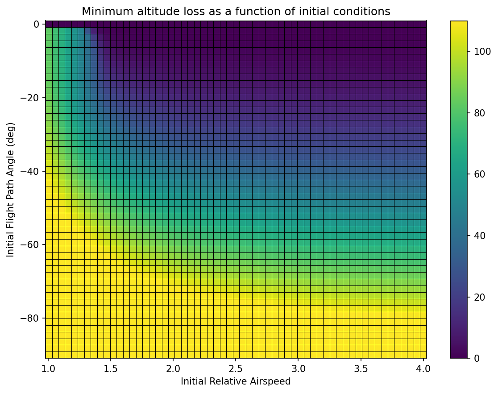

# 2DOF Reduced Symmetric Glider Pullout

Research code for aircraft stall upset recovery using VRAM-accelerated Policy Iteration.
The core approach solves the minimal altitude loss recovery problem as an infinite-horizon optimal control problem
via massively parallel Policy Iteration on continuous-state MDPs. Dynamics are integrated on-the-fly using
4th-order Runge-Kutta entirely within CUDA registers, avoiding the memory-bound limitations of traditional
transition table methods. Reference aircraft: **Grumman AA-1 Yankee** (Riley 1985, NASA TM-86309).

> **Reference paper:**
> Grillo, C., Torre, F., & Bunge, R. A. (2023).
> *Optimal Stall Recovery via Deep Reinforcement Learning for a General Aviation Aircraft.*
> AIAA SciTech Forum, National Harbor, MD.
> Universidad de San Andrés, Argentina.

---

### Running

Train the policy (or load from cache if `results/ReducedSymmetricGliderPullout_policy.npz` exists) and generate all figures:

```bash
python main.py --level 3
```

Available resolution levels:

| Flag | States | γ bins | V/Vs bins | Actions |
|---|---|---|---|---|
| `--level 1` | ~1.6 k | 51 | 31 | 51 |
| `--level 2` | ~6.2 k | 101 | 61 | 101 |
| `--level 3` | ~24 k | 201 | 121 | 201 |
| `--level 4` | ~97 k | 401 | 241 | 241 |
| `--level 5` | ~385 k | 801 | 481 | 481 |
| `--level 6` | ~1.5 M | 1601 | 961 | 961 |

Additional flags:

```bash
python main.py --level 3 --retrain   # ignore cache and retrain
python main.py --level 3 --no-plots  # train only, skip figures
```

Output is written to `results/`:

| File | Description |
|---|---|
| `ReducedSymmetricGliderPullout_policy.npz` | Trained value function and policy |
| `ReducedSymmetricGliderPullout_L{N}_heatmaps.png` | Minimum altitude loss heatmap |
| `ReducedSymmetricGliderPullout_L{N}_trajectory.png` | Sample recovery trajectory |

---

## Equations of Motion

Reduced nonlinear EOM in flight path angle representation under symmetric glider assumptions
($\beta = 0$, $\mu = 0$, $T = 0$):

$$\dot{V} = -g\sin\gamma - \frac{\rho S}{2m}\,V^2\,C_D$$

$$\dot{\gamma} = \frac{\rho S}{2m}\,V\,C_L - \frac{g}{V}\cos\gamma$$

where drag is computed from the lift coefficient via the angle-of-attack relation:

$$\alpha = \frac{C_L - C_{L_0}}{C_{L_\alpha}}, \qquad
C_D = C_{D_0} + C_{D_\alpha}\,\alpha + C_{D_{\alpha^2}}\,\alpha^2$$

**Symmetric glider assumptions:** $\beta = 0$, $\mu = 0$, $p = q = r = 0$, $T = 0$.

Under these assumptions the full 8-state nonlinear EOM reduce to a 2-state system:

| State | Symbol | Description |
|---|---|---|
| Flight path angle | $\gamma$ | angle between velocity vector and horizon |
| Normalized airspeed | $V/V_s$ | airspeed relative to stall speed |

| Control | Symbol | Description |
|---|---|---|
| Lift coefficient | $C_L$ | directly commanded (no pitch dynamics) |

The stall speed $V_s$ is derived from the stall lift coefficient:

$$C_{L_s} = C_{L_0} + C_{L_\alpha}\,\alpha_s, \qquad
V_s = \sqrt{\frac{2mg}{\rho S\,C_{L_s}}}$$

with $\alpha_s = 15°$.

---

## Discretization

### State Space

| State | Symbol | Min | Max | Resolution |
|---|---|---|---|---|
| Flight path angle | $\gamma$ | $-180°$ | $0°$ | adaptive (level) |
| Normalized airspeed | $V/V_s$ | $0.9$ | $4.0$ | adaptive (level) |

### Action Space

| Control | Min | Max | Resolution |
|---|---|---|---|
| Lift coefficient $C_L$ | $-0.5$ | $1.0$ | adaptive (level) |

### Terminal Conditions

| Condition | Type |
|---|---|
| $\gamma \geq 0°$ | Success — level flight recovered (absorbing) |
| $\gamma \leq -180°$ | Failure — unrecoverable dive (absorbing) |

### Solver

| Parameter | Value |
|---|---|
| Discount factor | $1.0$ (undiscounted) |
| Convergence threshold $\theta$ | $10^{-4}$ |
| Max evaluation iterations | $20\,000$ |
| Max PI outer iterations | $100$ |
| Integration step $dt$ | $0.01\,\text{s}$ |
| Integration scheme | RK4 (fused in CUDA) |
| Interpolation | 2D bilinear (CUDA registers) |

---

## Results

### Minimum Altitude Loss



Minimum expected altitude loss [m] as a function of initial flight path angle $\gamma$ and
initial normalized airspeed $V/V_s$, computed with the level-2 grid (~6 k states).
The optimal policy commands the $C_L$ that minimises total altitude loss from the current state
to level flight recovery ($\gamma = 0$). Altitude loss grows rapidly for steep dives ($\gamma < -60°$)
and near-stall speeds ($V/V_s \approx 1$), where the reduced lift margin limits recovery authority.
