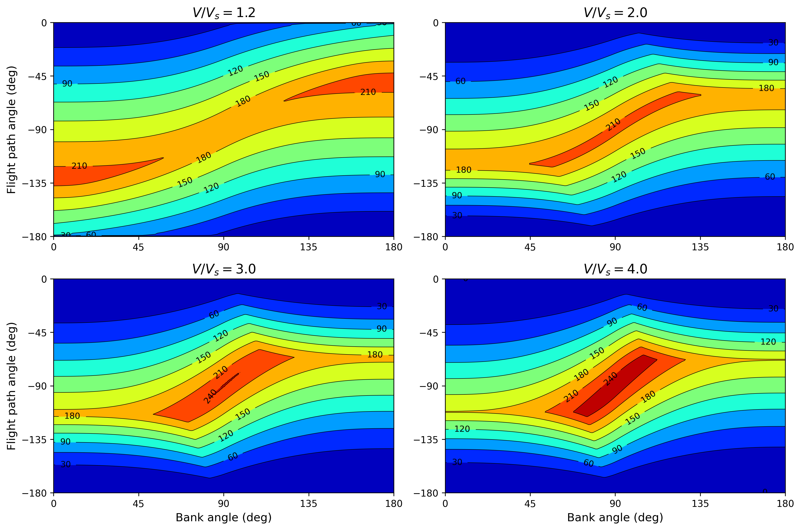
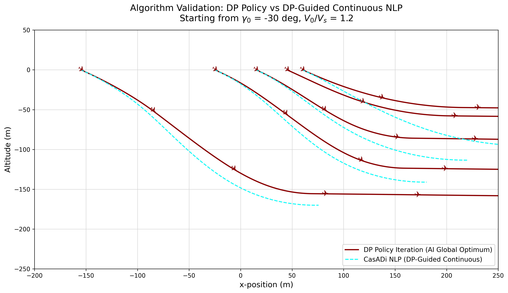
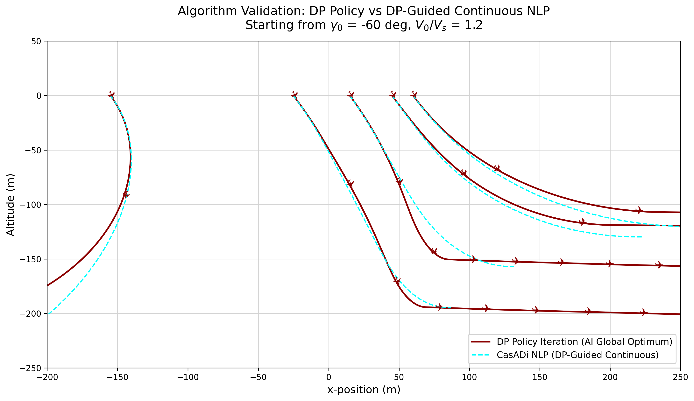
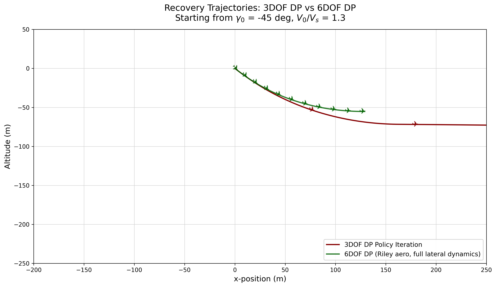
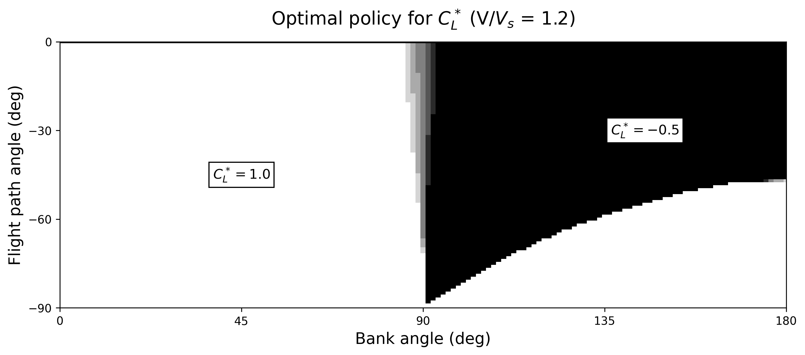
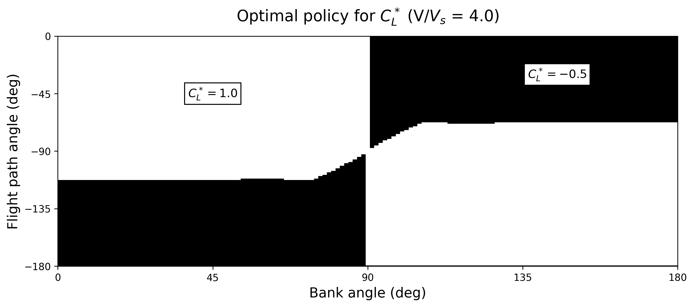
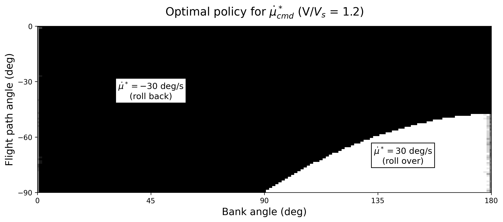
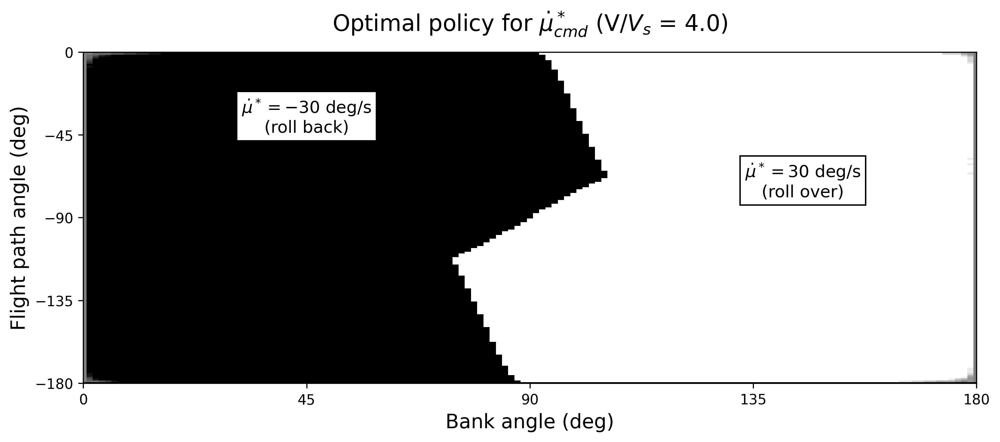
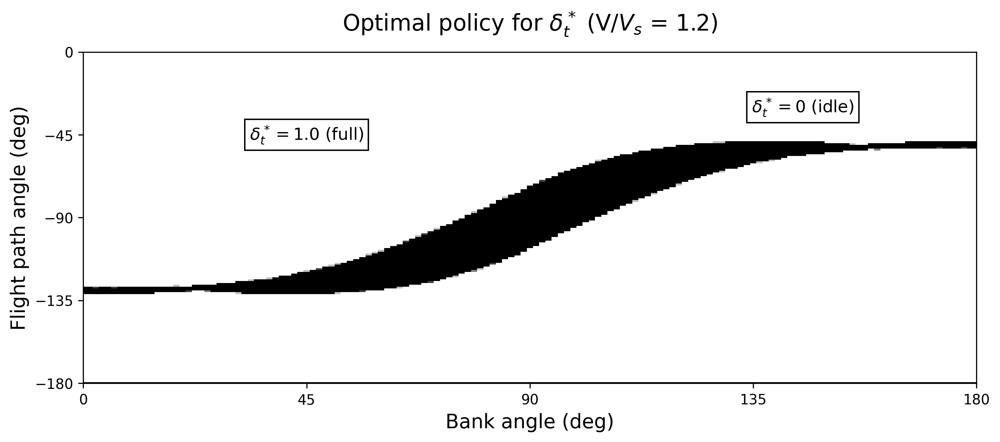
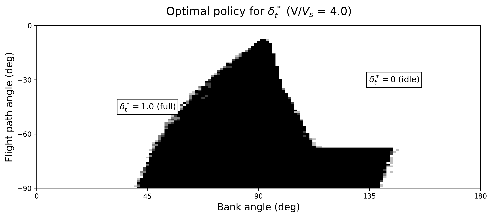

# 3-DOF Reduced Banked Pullout Model with Thrust

Research code for aircraft stall and spin upset recovery using VRAM-accelerated Dynamic Programming.
The core approach solves the minimal altitude loss recovery problem as an infinite-horizon optimal control
problem via massively parallel Policy Iteration on continuous-state MDPs. Dynamics are integrated
on-the-fly using 4th-order Runge-Kutta entirely within GPU registers, avoiding the memory-bound
limitations of traditional transition table methods. Reference aircraft: **Grumman AA-1 Yankee**
(Riley 1985, NASA TM-86309).

This branch extends the original *idle-power* reduced banked pullout from Bunge 2018 by adding
**throttle (δt) as a third action input**. The aerodynamic model remains the same linear/polynomial
formulation as in Bunge 2018 (CL is still commanded by an idealized inner-loop controller), so the
DP problem stays at 3 states; the only structural change is one extra dimension in the action space
plus a propulsive thrust term in V̇.

*Based on: Bunge, Pavone & Kroo, "Minimal Altitude Loss Pullout Maneuvers," AIAA GNC 2018.*

---

## Project Structure

```
stall-spin/
├── main.py                          # Entry point — pipeline train/load → profile → plot
├── requirements.txt
├── README.md
├── papers/                          # Reference papers (Bunge 2018, etc.)
├── results/                         # Output: policy .npz, plots, profiling reports
│
├── aircraft/                        # Physical aircraft models
│   ├── grumman.py                   # AA-1 Yankee: parameters, aerodynamic coefficients,
│   │                                #   throttle linear mapping, RK4 integrator helper
│   └── reduced_grumman.py           # 3DOF reduced dynamics: V̇, γ̇, μ̇ with thrust term
│
├── envs/                            # Gymnasium environments
│   ├── __init__.py                  # Gym registration
│   ├── base.py                      # AirplaneEnv: base gym.Env scaffold
│   └── reduced_banked_pullout.py    # 3DOF env: 3D obs, 3D action (CL, μ̇, δt), reward
│
├── solver/                          # Optimization algorithms
│   ├── policy_iteration.py          # GPU Policy Iteration: CUDA RK4 with thrust term,
│   │                                #   barycentric interpolation, Bellman updates
│   └── casadi_optimizer.py          # CasADi/IPOPT NLP optimizer (still 2D — idle power)
│
└── analysis/                        # Training configs, visualization and inference
    ├── experiments.py               # Grid level configs (L1–L4), Numba state/action
    │                                #   space generators (3D action), GPU profiling
    ├── plotting.py                  # Policy heatmaps (CL, μ̇, δt), value function contours,
    │                                #   DP vs CasADi trajectory validation plots
    └── interpolation.py             # Barycentric interpolation on N-D regular grids
                                     #   and get_optimal_action() for inference
```

---

## Installation

**Requirements:** Python 3.10+, NVIDIA GPU with CUDA-capable driver.

### 1. Create virtual environment

```bash
python -m venv .venv
source .venv/bin/activate
```

### 2. Install dependencies

```bash
pip install -r requirements.txt
```

### 3. Install CuPy (GPU backend)

CuPy must be installed separately because the correct wheel depends on your CUDA driver version.
Check your CUDA version with:

```bash
nvidia-smi
```

Then install the matching wheel:

| CUDA version (nvidia-smi) | Install command |
|---|---|
| 11.x | `pip install cupy-cuda11x` |
| 12.x | `pip install cupy-cuda12x` |
| 13.x | `pip install cupy-cuda12x` *(use 12x, backward-compatible)* |

> CuPy does not require the full CUDA toolkit (`nvcc`) — only the NVIDIA driver.
> If you get a `libnvrtc.so not found` error, install the CUDA runtime libraries:
> ```bash
> pip install nvidia-cuda-nvrtc-cu12 nvidia-cuda-runtime-cu12
> ```

### 4. Run

```bash
python main.py --level 1
```

Use `--retrain` to force retraining instead of loading a cached policy:

```bash
python main.py --level 1 --retrain
```

Available levels: `1` (paper grid, ~53k states), `2` (~409k), `3` (~4M), `4` (~32M, needs 24 GB VRAM).

---

## Model Description

This branch implements the reduced-order 3-DOF point-mass model from Bunge 2018, derived from
the full 6-DOF equations under the following simplifying assumptions:

- **β ≈ 0**: sideslip angle remains near zero throughout the maneuver.
- **CL and μ̇ are directly commanded** by inner-loop controllers (high-bandwidth, dynamics neglected).
- **CD = CD(CL)**: drag is a function of lift coefficient only (no sideslip dependency).
- **CY ≈ 0**: lateral aerodynamic side force is negligible.
- **Throttle (δt) is a third control input** (extension over Bunge 2018, which used idle power only).
  Thrust is modeled as a pure propulsive force in the velocity equation.

Under these assumptions the full equations of motion (Appendix A.2 of the paper) reduce to a
**3-state system** with state **x = (V, γ, μ)** and **3-action control** **a = (CL_cmd, μ̇_cmd, δt)**.

---

## Equations of Motion

```
V̇  = -g sin γ  -  (1/2) ρ (S/m) V² CD(CL_cmd)  +  K_t δ_t / m       (3a)
γ̇  =  (1/2) ρ (S/m) V CL_cmd cos μ  -  (g/V) cos γ                   (3b)
μ̇  =  μ̇_cmd                                                          (3c)
```

The propulsive term `K_t δ_t / m` in (3a) is the only structural change vs Bunge 2018.
`K_t` is calibrated so that full throttle (δt = 1) sustains level flight at V = 2 V_s
(see *Throttle Model* below).

---

## Aerodynamic Model — Grumman American AA-1 Yankee

Stability and control derivative model (Eq. 14, Table 2 of Bunge 2018). All angular derivatives per radian.

**Longitudinal:**
```
CL = 0.4100  +  4.6983 α  +  0.3610 δe  +  2.4200 q̂
CD = 0.0525  +  0.2068 α  +  1.8712 α²
Cm = 0.0760  -  0.8938 α  -  1.0313 δe  -  7.1500 q̂
```

**Lateral-directional:**
```
CY = -0.6303 β  +  0.0160 p̂  +  1.1000 r̂  -  0.0057 δa  +  0.1690 δr
Cl = -0.1089 β  -  0.5200 p̂  +  0.1900 r̂  -  0.1031 δa  +  0.0143 δr
Cn =  0.1003 β  -  0.0600 p̂  -  0.2000 r̂  +  0.0017 δa  -  0.0802 δr
```

In the 3-DOF reduced model only the longitudinal CL and the polynomial drag CD(α) are used.
α is recovered from the commanded CL via the linear inversion `α = (CL − CL₀) / CL_α`. Lateral
coefficients are listed for completeness — they are not used by the reduced model.

**Aircraft parameters** (aligned to Riley 1985 Table I for cross-comparison
with the 6-DOF banked-spin branch):

| Parameter | Value | Units | Source |
|---|---|---|---|
| m (mass) | 715.21 | kg | Riley Table I (1577 lb) |
| S (wing area) | 9.1147 | m² | Riley Table I |
| c (chord) | 1.22 | m | Riley Table I |
| b (wingspan) | 8.066 | m | Riley Table I (26.46 ft) |
| I_xx | 808.06 | kg·m² | Riley Table I |
| I_yy | 1000.60 | kg·m² | Riley Table I (738 slug·ft²) |
| I_zz | 1719.18 | kg·m² | Riley Table I (1268 slug·ft²) |
| ρ (sea-level density) | 1.225 | kg/m³ | — |
| CL_max (positive stall) | 1.26 | — | Riley III(a) flat-top plateau, CT=0 |
| α_stall⁺ | 14 | deg | Riley III(a) flat-top onset |
| α_stall⁻ | −10 | deg | Riley III(a) negative-stall onset |
| Vs (stall speed) | ≈ 31.6 | m/s | computed below |

> The 3-DOF reduced model uses Bunge 2018's **linear longitudinal aero**
> (CL = 0.41 + 4.6983 α + ..., CD polynomial in α). Only the *physical
> parameters* above (mass, geometry, inertias, CL_max for Vs calibration,
> stall onset α's) are aligned to Riley. The aero coefficient fit stays
> Bunge — that is the modeling choice this branch represents.

Vs is computed from level-flight equilibrium at CL_max:
```
Vs = sqrt(2 m g / (ρ S CL_max))
   = sqrt(2 × 715.21 × 9.81 / (1.225 × 9.1147 × 1.26))  ≈  31.57 m/s
```

---

## Throttle Model

Thrust is modeled as a **linear mapping** of the throttle command:

```
T(δ_t)  =  K_t · δ_t,        with  0 ≤ δ_t ≤ 1
```

`K_t` is calibrated so that full throttle (δ_t = 1) holds level flight at the maximum cruise speed
**V_max = 2 V_s**, i.e. at level cruise the propulsive force exactly balances drag at V_max:

```
K_t  =  D(V_max)  =  (1/2) ρ S V_max² CD(α_trim)
```

where α_trim is the trim angle of attack required to support 1g flight at V_max. This calibration
is done once at construction (`Grumman._initialize_throttle_model`) and the resulting numerical
value is exposed as `THROTTLE_LINEAR_MAPPING` ≈ 1110 N.

---

## Control Bounds

To prevent secondary stalls, CL_cmd is constrained within a safety margin of 0.2 from the
stall limits:

```
-0.5  ≤  CL_cmd  ≤  1.0                                   (4)
```

The bank rate command is bounded by the steady-state roll rate achievable with maximum aileron
deflection at the stall speed reference:

```
|μ̇_cmd|  ≤  μ̇_max  ≈  p_max                              (5a)

p_max  ≈  p̂_max (2 V_ref / b)  =  |Cl_δa / Cl_p| δa_max (2 V_ref / b)   (5b)
```

For the AA-1 Yankee: Cl_p ≈ −0.5, Cl_δa ≈ −0.0595 1/deg, δa_max = 25 deg, b = 7.41 m,
Vs ≈ 32 m/s → **p_max ≈ 30 deg/s**.

The throttle command is bounded to its physical range:

```
0  ≤  δ_t  ≤  1                                            (6)
```

---

## Reward Shaping

The per-step reward in the CUDA kernel matches the Gymnasium env step() **and is identical to the
original idle-power branch**:

```
r = h_dot · dt   −  0.01 · μ̇²_cmd · dt
```

Term-by-term:

- `h_dot · dt = V sin γ · dt` — primary cost (negative when descending; DP minimizes altitude loss).
- `−0.01 · μ̇² · dt` — bank-rate effort penalty (Bunge 2018).

> **Why no throttle term?** Keeping the reward bit-identical to the idle-power branch makes the
> A/B comparison clean: any difference in altitude loss between the two trained policies comes
> from the structural change (δt available as a control + thrust term in V̇), not from a different
> cost function. With this reward the policy may saturate δt = 1 in many states — that is the
> physically optimal response when the only objective is to minimize altitude loss and there is
> no penalty on thrust use.

---

## State-Space Discretization (Bunge 2018 Table 1, with δt extension)

| Variable | Lower Bound | Increment | Upper Bound | Units | Bins (L1) |
|---|---|---|---|---|---|
| V | 0.9 | 0.1 | 4.0 | 1/Vs | 32 |
| γ | −180 | 5 | 0 | deg | 37 |
| μ | −20 | 5 | 200 | deg | 45 |
| **CL_cmd** | **−0.5** | **0.25** | **1.0** | **—** | **7** |
| **μ̇_cmd** | **−30** | **5** | **30** | **deg/s** | **13** |
| **δt** | **0.0** | **0.25** | **1.0** | **—** | **5** |

Total at level L1: 37 × 32 × 45 = **53,280 states**, 7 × 13 × 5 = **455 actions**. Levels L2–L4
refine the state space (up to ~32 M states at L4, 24 GB VRAM); the action grid is shared across all
four levels.

---

## Results

### Value Function — Minimum Altitude Loss (m)

Minimum pullout altitude loss as a function of bank angle and flight path angle,
for four normalized airspeeds. Warmer colors indicate greater altitude loss.



---

### Algorithm Validation — DP Policy vs CasADi NLP

Optimal pullout trajectories comparing the DP Policy Iteration solution (global optimum, dark red)
against a CasADi/IPOPT continuous NLP warm-started from the DP policy (cyan dashed).
For Fig3 and Fig4 each curve corresponds to a different initial bank angle
μ₀ ∈ {30, 60, 90, 120, 150} deg (left to right).

> **Note**: the CasADi NLP solver is still the original 2D (CL, μ̇) idle-power formulation from
> Bunge 2018, while the DP rollout uses the full 3D action with throttle. The DP curve will
> generally show smaller altitude loss than CasADi by virtue of having access to the extra control.

> **6DOF overlay (dark green)**: when CSV trajectories from the 6DOF banked-spin branch
> (`6dof-banked-spin-riley`) are present in `results/comparison_csvs/`, they are overlaid on each
> figure for direct visual comparison. The 6DOF model operates under simplification A.i
> (β = 0, r = 0, δr = 0) which **declares unrecoverable any initial state with |μ₀| ≥ 90°**
> (inverted attitudes are outside its envelope). For those scenarios only the 3DOF idealized
> policy and the CasADi NLP are shown — the absent green line is a physically meaningful
> limitation, not a missing data point.

| γ₀ = −30 deg, V/Vs = 1.2 | γ₀ = −60 deg, V/Vs = 1.2 |
|:---:|:---:|
|  |  |

#### Spiral-dive scenario (single μ₀ = 30 deg, V/Vs = 1.3)

Recovery from a moderate spiral dive: γ₀ = −45 deg, V/Vs = 1.3, μ₀ = 30 deg.
This single-trajectory case is the natural reference scenario for cross-comparison
with the 6-DOF banked-spin model on the same initial condition.



---

### Optimal Policy for C*_L

White = C*_L = 1.0 (max lift, pull up). Black = C*_L = −0.5 (push forward, inverted pullout).
The switching surface shifts with airspeed.

| V/Vs = 1.2 | V/Vs = 4.0 |
|:---:|:---:|
|  |  |

---

### Optimal Policy for μ̇*_cmd

Black = −30 deg/s (roll back to wings-level). White = +30 deg/s (roll over, inverted).

| V/Vs = 1.2 | V/Vs = 4.0 |
|:---:|:---:|
|  |  |

---

### Optimal Policy for δ*_t

Black = 0 (idle). White = 1 (full throttle). The throttle bonus encourages full throttle below Vs
and makes throttle modulation visible above Vs.

| V/Vs = 1.2 | V/Vs = 4.0 |
|:---:|:---:|
|  |  |

---

## Nomenclature

| Symbol | Meaning |
|---|---|
| ρ | air density |
| b | wing span |
| c | chord length |
| S | wing surface area |
| px, py, pz | northward, eastward and down position |
| h | altitude, from the ground |
| u, v, w | body-x, y and z velocity |
| V | airspeed |
| Vs | stall speed |
| α | angle of attack |
| β | sideslip angle |
| φ, θ, ψ | roll, pitch and yaw angles |
| γ | flight path angle |
| ξ | heading angle |
| μ | bank angle |
| ε₀, ε₁, ε₂, ε₃ | Euler (quaternion) parameters |
| p̂ | dimensionless roll rate, p̂ = pb/2V |
| p, q, r | roll, pitch and yaw rate |
| δe | elevator deflection, positive trailing edge down |
| δr | rudder deflection, positive trailing edge to the left |
| δa | aileron deflection, positive trailing edge down of right aileron |
| δt | throttle position (third control input in this branch) |
| K_t | linear thrust mapping coefficient (T = K_t · δt) |
| CL_cmd | commanded lift coefficient (outer-loop control input) |
| μ̇_cmd | commanded bank rate (outer-loop control input) |
| L, D, Y | aerodynamic lift, drag and side force |
| Mx, My, Mz | aerodynamic rolling, pitching and yawing moment about the c.g. |
| CL, CD, CY | aerodynamic lift, drag and side force coefficient |
| Cl, Cm, Cn | aerodynamic rolling, pitching and yawing moment coefficient about the c.g. |
| f | system dynamic equation of motion |
| J | value function |
| g | stage cost |
| a | vector of actions |
