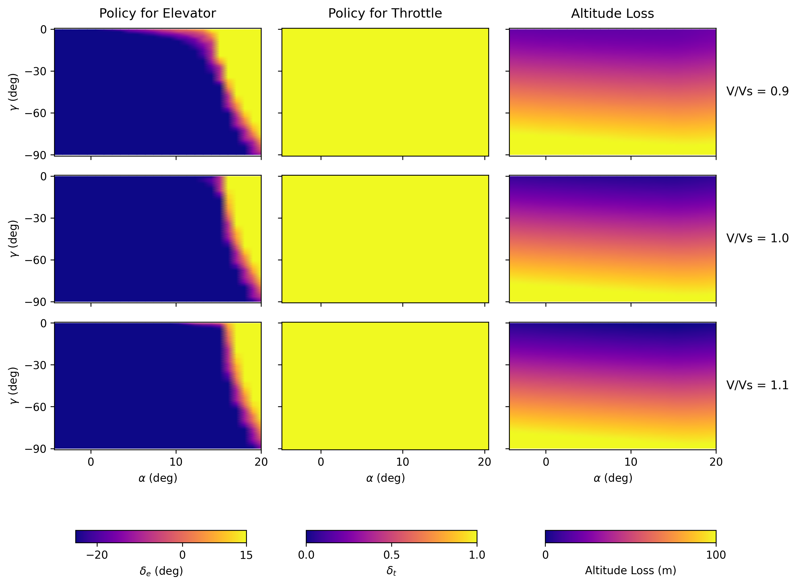

# 4DOF Symmetric Stall Recovery

Research code for aircraft stall upset recovery using Deep Reinforcement Learning (PPO) and Dynamic Programming.
The core approach solves the minimal altitude loss recovery problem as an infinite-horizon optimal control problem.
Reference aircraft: **Grumman AA-1 Yankee** (Riley 1985, NASA TM-86309).

> **Reference paper:**
> Grillo, C., Torre, F., & Bunge, R. A. (2023).
> *Optimal Stall Recovery via Deep Reinforcement Learning for a General Aviation Aircraft.*
> AIAA SciTech Forum, National Harbor, MD.
> Universidad de San Andrés, Argentina.

---

## Installation

### Requirements

- Python 3.10+
- CUDA 12.x and a compatible NVIDIA GPU

### Setup

```bash
git clone <repo-url>
cd stall-spin
python -m venv .venv
source .venv/bin/activate
```

Install Python dependencies:

```bash
pip install -r requirements.txt
```

Install CuPy matching your CUDA version (the solver runs entirely on GPU):

```bash
# CUDA 12.x
pip install cupy-cuda12x

# CUDA 11.x
pip install cupy-cuda11x
```

### Running

Train the policy (or load from cache if `results/SymmetricStall_policy.npz` exists) and generate all figures:

```bash
python main.py
```

Output is written to `results/`:

| File | Description |
|---|---|
| `SymmetricStall_policy.npz` | Trained value function and policy |
| `symmetric_stall_Markovian_DP.png` | Recovery trajectory |
| `symmetric_stall_Fig6_Stall_Heatmaps.png` | Optimal policy heatmaps |

---

## Model

**Symmetric flight assumptions:** $\beta = 0$, $\mu \approx 0$, $p = r = 0$.

Under these assumptions the full 8-state nonlinear EOM reduce to a 4-state system:

| State | Symbol | Description |
|---|---|---|
| Flight path angle | $\gamma$ | angle between velocity vector and horizon |
| Airspeed | $V$ | total airspeed |
| Angle of attack | $\alpha$ | angle between velocity and body x-axis |
| Pitch rate | $q$ | body-axis pitch rate |

| Control | Symbol | Description |
|---|---|---|
| Elevator deflection | $\delta_e$ | positive trailing edge down |
| Throttle | $\delta_t$ | engine thrust command |

---

## Equations of Motion

Full nonlinear EOM in flight path and flow angle representation (Eq. 7, Grillo et al. 2023):

$$\dot{V} = -g \sin\gamma - \frac{(D - T\cos\alpha)\cos\beta - Y\sin\beta}{m} \tag{7a}$$

$$\dot{\gamma} = \frac{L + T\sin\alpha}{mV}\cos\mu - \frac{g}{V}\cos\gamma - \frac{(D - T\cos\alpha)\sin\beta + Y\cos\beta}{mV}\sin\mu \tag{7b}$$

$$\dot{\mu} = (\cos\beta + \tan\beta\sin\beta)(p\cos\alpha + r\sin\alpha) + \left(\sin\mu\tan\gamma + \tan\beta\right)\frac{L + T\sin\alpha}{mV}$$
$$\quad + \frac{(D - T\cos\alpha)\sin\beta + Y\cos\beta}{mV}\cos\mu\tan\gamma - \frac{g}{V}\cos\gamma\cos\mu\tan\beta \tag{7c}$$

$$\dot{\alpha} = q - \sec\beta\left(\frac{L + T\sin\alpha}{mV} - \frac{g}{V}\cos\gamma\cos\mu\right) - \tan\beta\,(p\cos\alpha + r\sin\alpha) \tag{7d}$$

$$\dot{\beta} = \frac{(D - T\cos\alpha)\sin\beta + Y\cos\beta}{mV} + \frac{g}{V}\cos\gamma\sin\mu - (r\cos\alpha - p\sin\alpha) \tag{7e}$$

$$\dot{p} = \frac{M_x}{I_{xx}} - qr\,\frac{I_{zz} - I_{yy}}{I_{xx}} \tag{7f}$$

$$\dot{q} = \frac{M_y}{I_{yy}} + pr\,\frac{I_{zz} - I_{xx}}{I_{yy}} \tag{7g}$$

$$\dot{r} = \frac{M_z}{I_{zz}} - pq\,\frac{I_{yy} - I_{xx}}{I_{zz}} \tag{7h}$$

Under symmetric flight ($\beta = 0$, $\mu = 0$, $p = r = 0$), these collapse to:

$$\dot{V} = -g\sin\gamma - \frac{D - T\cos\alpha}{m}$$

$$\dot{\gamma} = \frac{L + T\sin\alpha}{mV} - \frac{g}{V}\cos\gamma$$

$$\dot{\alpha} = q - \frac{L + T\sin\alpha}{mV} + \frac{g}{V}\cos\gamma$$

$$\dot{q} = \frac{M_y}{I_{yy}}$$

Aerodynamic forces and moments use the same AA-1 Yankee coefficients as Bunge et al. 2018 (Tables 1 & 2).

---

## Discretization

### State Space — 3,388,896 nodes

| State | Symbol | Min | Max | Bins | Resolution |
|---|---|---|---|---|---|
| Flight path angle | $\gamma$ | $-90°$ | $5°$ | 56 | $\approx 1.7°$ |
| Normalized airspeed | $V/V_s$ | $0.9$ | $2.0$ | 41 | $0.028$ |
| Angle of attack | $\alpha$ | $-14°$ | $20°$ | 36 | $\approx 0.97°$ |
| Pitch rate | $q$ | $-50\,°/s$ | $50\,°/s$ | 41 | $\approx 2.5\,°/s$ |

Total: $56 \times 41 \times 36 \times 41 = 3{,}388{,}896$ states.

### Action Space — 147 actions

| Control | Min | Max | Bins | Resolution |
|---|---|---|---|---|
| Elevator $\delta_e$ | $-25°$ | $15°$ | 21 | $2°$ |
| Throttle $\delta_t$ | $0$ | $1$ | 7 | $\approx 0.17$ |

Total: $21 \times 7 = 147$ discrete actions.

### Terminal Conditions

| Condition | Type |
|---|---|
| $\gamma \geq 0°$ | Success (absorbing) |
| $|\alpha| \geq 40°$ | Failure — deep stall / structural limit |
| $\gamma \leq -175°$ | Failure — unrecoverable dive |

### Solver

| Parameter | Value |
|---|---|
| Discount factor | $1.0$ (undiscounted) |
| Convergence threshold $\theta$ | $5 \times 10^{-6}$ |
| Max iterations | $1000$ |
| Integration step $dt$ | $0.01\,\text{s}$ |
| Interpolation | 4D Barycentric (CUDA) |

---

## Results

### Optimal Policy (Elevator, Throttle, Altitude Loss)



Optimal elevator deflection, throttle command and expected altitude loss as a function of
flight path angle $\gamma$ and angle of attack $\alpha$, for three airspeeds ($V/V_s = 0.9,\,1.0,\,1.1$)
at zero pitch rate. At stalled angles of attack ($\alpha > 15°$) and near-stall speeds the
optimal policy commands full nose-down elevator with full throttle. Once the angle of attack
drops below stall, the policy reverses to pitch-up elevator to complete the pullout.

### Stall Recovery Trajectory


Sample recovery from $\gamma = 0°$, $V/V_s = 0.95$, $\alpha = 20°$, $q = 0\,\text{deg/s}$.
The DP policy commands immediate full nose-down elevator and full throttle, reducing $\alpha$
below the stall angle, then transitions to a moderate pitch-up input to recover level flight
with minimal altitude loss.

---

## Nomenclature

| Symbol | Meaning |
|---|---|
| $\rho$ | air density |
| $b$ | wing span |
| $\bar{c}$ | mean aerodynamic chord |
| $S$ | wing surface area |
| $V$ | airspeed |
| $\alpha$ | angle of attack |
| $\beta$ | sideslip angle |
| $\phi, \theta, \psi$ | roll, pitch and yaw angles |
| $\gamma$ | flight path angle |
| $\mu$ | bank angle |
| $p, q, r$ | roll, pitch and yaw rate |
| $\delta_e$ | elevator deflection, positive trailing edge down |
| $\delta_r$ | rudder deflection, positive trailing edge to the left |
| $\delta_a$ | aileron deflection, positive trailing edge down of right aileron |
| $\delta_t$ | throttle position |
| $L, D, Y$ | aerodynamic lift, drag and side force |
| $M_x, M_y, M_z$ | aerodynamic rolling, pitching and yawing moment about the c.g. |
| $C_L, C_D, C_Y$ | lift, drag and side force coefficients |
| $C_l, C_m, C_n$ | rolling, pitching and yawing moment coefficients |
| $T$ | engine thrust |
| $J$ | value function |
| $g$ | stage cost |
| $a$ | vector of actions |
