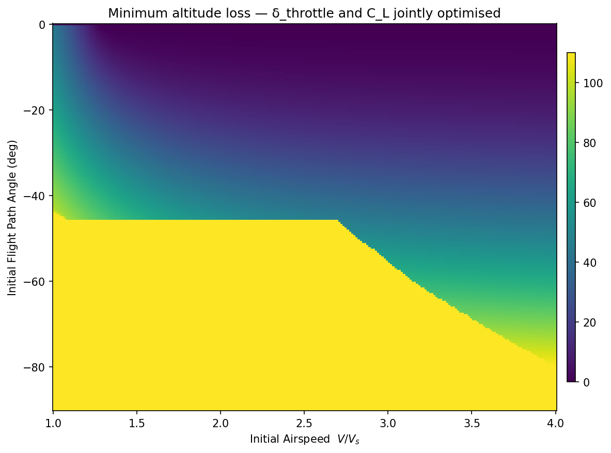
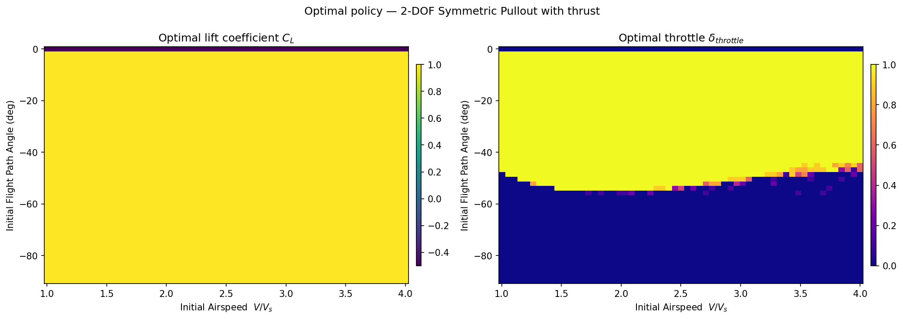
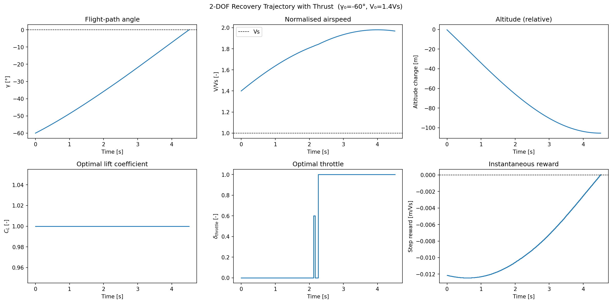

# 2DOF Reduced Symmetric Pullout with Thrust

Research code for aircraft stall upset recovery using VRAM-accelerated Policy Iteration.
The core approach solves the minimal altitude loss recovery problem as an infinite-horizon optimal control problem
via massively parallel Policy Iteration on continuous-state MDPs. Dynamics are integrated on-the-fly using
4th-order Runge-Kutta entirely within CUDA registers, avoiding the memory-bound limitations of traditional
transition table methods. Reference aircraft: **Grumman AA-1 Yankee** (Riley 1985, NASA TM-86309).

This model extends the symmetric glider formulation by including a throttle control input, enabling the solver
to jointly optimise lift and thrust during the recovery manoeuvre.

> **Reference paper:**
> Grillo, C., Torre, F., & Bunge, R. A. (2023).
> *Optimal Stall Recovery via Deep Reinforcement Learning for a General Aviation Aircraft.*
> AIAA SciTech Forum, National Harbor, MD.
> Universidad de San Andrés, Argentina.

---

### Running

Train the policy (or load from cache if `results/ReducedSymmetricPullout_policy.npz` exists) and generate all figures:

```bash
python main.py --level 3
```

Available resolution levels:

| Flag | States | γ bins | V/Vs bins | CL bins | δ_throttle bins | Actions |
|---|---|---|---|---|---|---|
| `--level 1` | ~1.6 k | 51 | 31 | 16 | 8 | 128 |
| `--level 2` | ~6.2 k | 101 | 61 | 21 | 11 | 231 |
| `--level 3` | ~24 k | 201 | 121 | 31 | 16 | 496 |
| `--level 4` | ~97 k | 401 | 241 | 41 | 21 | 861 |
| `--level 5` | ~385 k | 801 | 481 | 51 | 26 | 1326 |
| `--level 6` | ~1.5 M | 1601 | 961 | 61 | 31 | 1891 |

Additional flags:

```bash
python main.py --level 3 --retrain   # ignore cache and retrain
python main.py --level 3 --no-plots  # train only, skip figures
```

Output is written to `results/`:

| File | Description |
|---|---|
| `ReducedSymmetricPullout_policy.npz` | Trained value function and policy |
| `ReducedSymmetricPullout_heatmaps.png` | Minimum altitude loss heatmap |
| `ReducedSymmetricPullout_policy.png` | Optimal $C_L$ and $\delta_{throttle}$ heatmaps |
| `ReducedSymmetricPullout_trajectory.png` | Sample recovery trajectory |

---

## Equations of Motion

Reduced nonlinear EOM in flight path angle representation under symmetric assumptions
($\beta = 0$, $\mu = 0$) with thrust:

$$\dot{V} = -g\sin\gamma - \frac{\rho S}{2m}\,V^2\,C_D + \frac{K_t\,\delta_t}{m}$$

$$\dot{\gamma} = \frac{\rho S}{2m}\,V\,C_L - \frac{g}{V}\cos\gamma$$

where drag is computed from the lift coefficient via the angle-of-attack relation:

$$\alpha = \frac{C_L - C_{L_0}}{C_{L_\alpha}}, \qquad
C_D = C_{D_0} + C_{D_\alpha}\,\alpha + C_{D_{\alpha^2}}\,\alpha^2$$

The throttle is modelled as a linear thrust mapping:

$$T = K_t\,\delta_t, \qquad K_t = \frac{\rho S}{2}\,V_{max}^2\,C_{D}(V_{max})$$

where $K_t$ is calibrated so that $\delta_t = 1$ produces enough thrust to maintain level cruise
at $V_{max} = 2\,V_s$.

**Symmetric assumptions:** $\beta = 0$, $\mu = 0$, $p = q = r = 0$.

Under these assumptions the full 8-state nonlinear EOM reduce to a 2-state system:

| State | Symbol | Description |
|---|---|---|
| Flight path angle | $\gamma$ | angle between velocity vector and horizon |
| Normalized airspeed | $V/V_s$ | airspeed relative to stall speed |

| Control | Symbol | Range | Description |
|---|---|---|---|
| Lift coefficient | $C_L$ | $[-0.5,\ 1.0]$ | directly commanded (no pitch dynamics) |
| Throttle | $\delta_t$ | $[0.0,\ 1.0]$ | fraction of maximum thrust |

The stall speed $V_s$ is derived from the stall lift coefficient:

$$C_{L_s} = C_{L_0} + C_{L_\alpha}\,\alpha_s, \qquad
V_s = \sqrt{\frac{2mg}{\rho S\,C_{L_s}}}$$

with $\alpha_s = 15°$.

---

## Discretization

### State Space

| State | Symbol | Min | Max | Resolution |
|---|---|---|---|---|
| Flight path angle | $\gamma$ | $-180°$ | $0°$ | adaptive (level) |
| Normalized airspeed | $V/V_s$ | $0.9$ | $4.0$ | adaptive (level) |

### Action Space

The action space is the Cartesian product of independent $C_L$ and $\delta_t$ grids:

| Control | Min | Max | Resolution |
|---|---|---|---|
| Lift coefficient $C_L$ | $-0.5$ | $1.0$ | adaptive (level) |
| Throttle $\delta_t$ | $0.0$ | $1.0$ | adaptive (level) |

Total number of actions = $n_{C_L} \times n_{\delta_t}$.

### Terminal Conditions

| Condition | Type |
|---|---|
| $\gamma \geq 0°$ | Success — level flight recovered (absorbing) |
| $\gamma \leq -180°$ | Failure — unrecoverable dive (absorbing) |

### Solver

| Parameter | Value |
|---|---|
| Discount factor $\gamma$ | $0.99$ |
| Convergence threshold $\theta$ | $10^{-4}$ |
| Max evaluation iterations | $20\,000$ |
| Max PI outer iterations | $100$ |
| Integration step $dt$ | $0.01\,\text{s}$ |
| Integration scheme | RK4 (fused in CUDA) |
| Interpolation | 2D bilinear (CUDA registers) |

---

## Results

### Minimum Altitude Loss



Minimum expected altitude loss [m] as a function of initial flight path angle $\gamma$ and
initial normalized airspeed $V/V_s$.
The optimal policy jointly commands $C_L$ and $\delta_t$ to minimise total altitude loss from
the current state to level flight recovery ($\gamma = 0$).

### Optimal Policy



Left: optimal lift coefficient $C_L$ as a function of initial conditions.
Right: optimal throttle $\delta_t$ as a function of initial conditions.
The thrust authority becomes most relevant at low speeds near stall, where additional energy
is needed to avoid an unrecoverable dive.

### Recovery Trajectory



Sample optimal recovery from $\gamma_0 = -60°$, $V_0 = 1.4\,V_s$:
flight path angle, normalized airspeed, altitude change, optimal $C_L$, optimal $\delta_t$,
and instantaneous reward.
